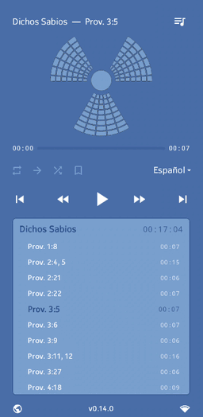

#  nwtReactor App

Have you ever wanted to **listen to selected verses** from the Bible, or make a playlist of favorite chapters?

This is an **Android app**[^1] to stream audio for selected verses from the [*New World Translation of the Holy Scriptures*](https://www.jw.org/en/library/bible/study-bible/books/)[^2].

You create playlists by typing, pasting or importing text that contains scripture references. The text is parsed and only valid scriptures are added to the playlist, ranging from single verses to whole chapters.

The same playlist can be played in any of the available languages: **Danish, Dutch, English, French, German, Italian, Korean, Polish, Portuguese, Spanish, or Ukrainian**. Scripture parsing (for playlist generation) can also handle all these languages as input.

Playlists can be saved or shared as simple text files and imported on another device.

**NOTE**: *nwtReactor* requires INTERNET access because the audio is streamed via the *jw.org* API (as is done by a browser). Tracks/segments are cached to reduce bandwidth and server load.

**Latest release**: COMING SOON

Preview…
 

 

How to use…
 

  toggle loop: if enabled, will play current playlist over and over

  toggle continue: if enabled, will play next list after current finishes

  toggle shuffle: will play tracks in random order (playlists don't shuffle)

  each playlist can have one bookmark (position marker); if unset, single tap will set at current track/position; if set, single tap will play from that saved track/position; if set, long-tap will unset/remove

 single-tap: go to first track of current playlist; double-tap: go to previous playlist

 go to next playlist (looping around)

  go to previous or next track in the same playlist (looping)

 play or pause

 manage playlists; here you can reorder the playlists (tap-and-drag to new position), create a new one or edit a current list by tapping it

 go to website

 manage mobile network connection

 export playlist (save to local file system)

 share playlist

 delete playlist

 

____
 

By using this software you agree to abide by the terms of its [License](https://github.com/erykjj/nwtReactor-app#License-1-ov-file).

Feel free to get in touch and post any [issues and/or suggestions](https://github.com/erykjj/nwtReactor-app/issues).

My other Android apps: [**jwlFission**](https://github.com/erykjj/jwlFission-app) & [**jwlFusion**](https://github.com/erykjj/jwlFusion-app)

____
#### Footnotes:
[^1]: Android 10+, arm64-v8a & x86_64

[^2]: © *Watch Tower Bible and Tract Society of Pennsylvania*
